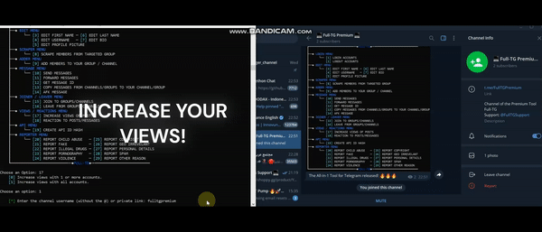
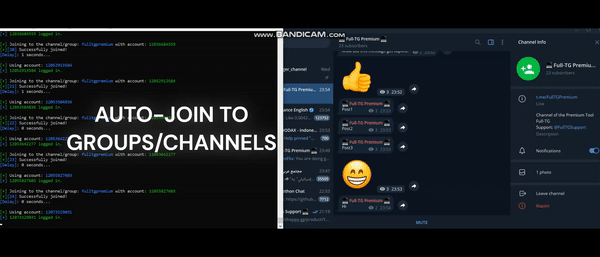

# Telegram-Automation-Toolkit
🚀 Telegram Marketing Automation Tool with 43+ functions - Member Adder, Scraper, Mass DM, Reporter, Forwarder, API ID Creator and more.

# GET HERE: https://shorturl.at/rDN9K
## For any questions: https://shorturl.at/pfRnW

### TelegramTool #TelegramMarketing #TelegramBot #Automation

## ✨ Almost 50 Features

### 👥 Member Management
- **Telegram Member Adder** - Add users to groups/channels

- **Active Member Scanner** - Identify most active participants
- **Telegram Scraper** - Extract members from groups/channels (+200k)
- **User Extractor** - Export user databases (+200k)
- **Member Filter** - Filter users by activity, date, premium etc.

- **Clone/Copy Targets** - Clone/Copy any target in real-time.

### ❌ Delete Competition

### 📢 Mass Communication

- **Mass DM Sender** - Bulk direct messaging
- **Message Forwarder** - Cross-group message sharing
- **Forward Old Messages** - Archive and forward historical messages
- **Forward Messages Realtime** - Instant message relay between chats
- **Realtime Message Scraper** - Capture all incoming new messages
- **Complete Message Scraper** - Scrape all old messages from groups/channels
- **Auto Reply** - Response system
- **Scheduled Messaging** - Time-based message delivery
- **Automatic Polls** - Generate and manage polls automatically
- **Message Templates** - Create and reuse message templates
- **Multi-Language Support** - Send messages in different languages
- **Media Attachment** - Support for files, images, and videos
- **HTML Formatting** - Rich text message capabilities

### 🚀 Engagement Boosting
- **Increase Views** - Boost post visibility and view counts

- **Reactions Bot** - Automatic emoji reactions to posts
- **View Booster** - Enhance content visibility
- **Group/Channel Finder** - Identify links for groups/channels with your keywords.
- **Hashtag Optimizer** - Automatic hashtag research

### 🔐 Account Management
- **API ID Creator** - Generate Telegram API credentials
- **Session Manager** - Handle multiple accounts

- **Proxy Supported** - Full proxy integration (HTTP/SOCKS)
- **Auto-Joiner** - Join any target automatically with every acc.

- **Auto-Leaver** - Leave any target automatically with every acc
- **Ban-Checker** - Check if acc's are banned and clean your list.
- **Spam-Checker** - Check if you acc's are ready to go.
- **Frozen-Checker** - Check if your acc's are ready to go. (New from TG)
- **Unspam Acc's** - Remove any limits.
- **Unfreeze Acc's** - Remove the Frozen status of your acc's.
### AND MUCH MORE!

# GET HERE: https://shorturl.at/rDN9K
## For any questions: https://shorturl.at/pfRnW
